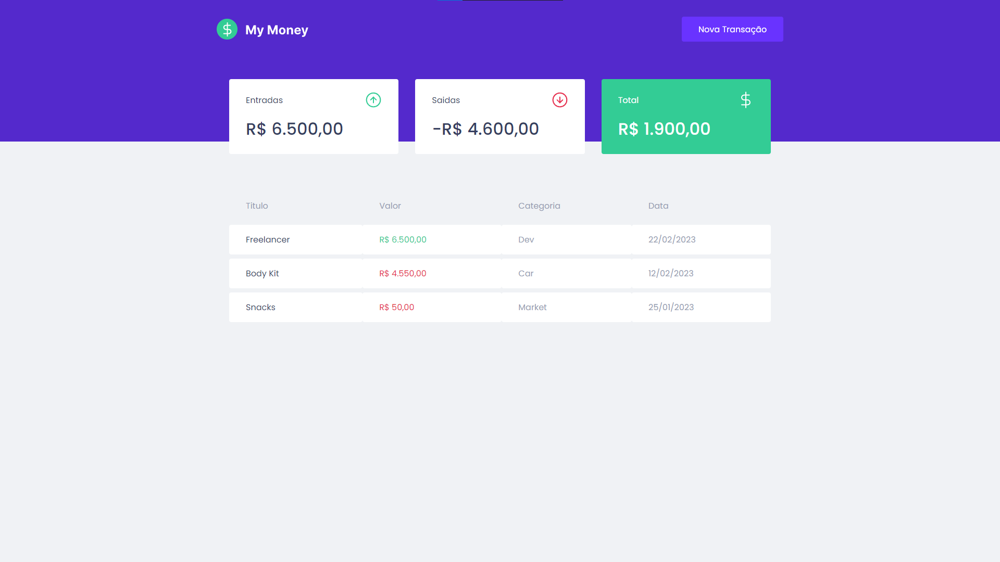

# dt money

<p>
  
  
  
</p>


## Tópicos

[Sobre o My Money](#sobre-o-my-money)

[Tecnologias](#tecnologias)

[Instalação e uso](#instalação-e-uso)

<br>

## Sobre o my money

O My Money é uma alternativa simples e eficaz para gerenciar suas finanças, permitindo o cadastro de entradas, saídas e a organização das mesmas em categorias.

<br>

<p align="center">
  
</p>

## Tecnologias

Tecnologias e ferramentas utilizadas no desenvolvimento do projeto:

- [React](https://reactjs.org/)
- [TypeScript](https://www.typescriptlang.org/)
- [Styled Components](https://styled-components.com/)
- [MirageJS](https://miragejs.com/)
- [Axios](https://github.com/axios/axios)
- [Polished](https://polished.js.org/)

<br>

## Instalação e uso

```bash
# Abra um terminal e copie este repositório com o comando
git clone https://github.com/Zilla3k/mymoneyapp.git

# Entre na pasta web com
cd mymoneyapp

# Instale as dependências
yarn install

# Rode a aplicação
yarn start

# Cole o URL no seu navegador
http://localhost:3000/
```

## <br>

Feito com :orange_heart: by [Henrique Pelanda](https://github.com/zilla3k)

[](https://www.linkedin.com/in/henrique-pelanda/)
[](mailto:henriquepelanda.web@gmail.com)
